# Tomba Email Finder Cli 🔥

CLI utility to search or verify email addresses in minutes.

## Features ✨

- 🛡️ Instantly locate email addresses from any website.
- 🛡️ Email verify to confirm an email address' authenticity.
- 🛡️ Enrich email with data.
- 🛡️ Instantly discover the email addresses of Linkedin URLs.
- 🛡️ Instantly discover the email addresses of article authors.
- 🛡️ Search for phone numbers given an email, domain, or LinkedIn URL.
- 🛡️ Validate phone numbers.
- 🛡️ Retrieve domains similar to a specific domain.
- 🛡️ Discover technologies detected for a domain.
- 🛡️ Search for companies using natural language or structured filters.
- 🛡️ Print current account information.
- 🤖 AI Chat — natural language queries powered by OpenAI with Tomba tools.
- 📦 Bulk CSV processing — enrich, verify, find, author, linkedin, phone, and sources from CSV files with auto column mapping.
- 🧩 ClawHub Skills — reusable multi-step workflows that chain API calls into one command.

## Installation

### Quick Install (Linux / macOS)

```bash
curl -sSL https://releases.tomba.io/install.sh | sh
```

### Quick Install (Windows PowerShell)

```powershell
irm https://releases.tomba.io/install.ps1 | iex
```

### Using Snap

[](https://snapcraft.io/tomba)

```bash
sudo snap install tomba
```

### Using Go

Make sure that `$GOPATH/bin` is in your `$PATH`, because that's where this gets
installed:

```bash
go install github.com/tomba-io/tomba@latest
```

### Using homebrew tap

[The formula](https://github.com/tomba-io/homebrew-tap/blob/master/Formula/tomba.rb)

```bash
brew install tomba-io/tap/tomba
```

### Using scoop

```bash
scoop bucket add tomba https://github.com/tomba-io/scoop-bucket.git
scoop install tomba
```

## Get Started 🎉

By default, invoking the CLI shows a help message:

```bash
tomba
```


### Login

Sign in to Tomba account. Two methods available:

**OAuth (browser-based, no keys needed):**

```bash
tomba login
```

<details>
<summary>Demo: tomba login (OAuth)</summary>


</details>

**API Key + Secret:**

```bash
tomba login --key ta_xxxx --secret ts_xxxx
```

<details>
<summary>Demo: tomba login (API Key)</summary>



</details>

### Domain Search

Instantly locate email addresses from any company name or website.

```bash
tomba search --target "tomba.io"
```

<details>
<summary>Demo: tomba search</summary>


</details>

<details>
<summary>Demo: tomba search --json</summary>


</details>

<details>
<summary>Demo: tomba search --yaml</summary>


</details>

Slack Command: `/search tomba.io`

### Email Finder

Retrieves the most likely email address from a domain name, a first name and a last name.

```bash
tomba finder --target "tomba.io" --fist "mohamed" --last "ben rebia"
tomba finder --target "tomba.io" --fist "mohamed" --last "ben rebia" --enrich-mobile
```

<details>
<summary>Demo: tomba finder</summary>



</details>

### Enrichment

Locate and include data in your emails.

```bash
tomba enrich --target "b.mohamed@tomba.io"
tomba enrich --target "b.mohamed@tomba.io" --enrich-mobile
```

<details>
<summary>Demo: tomba enrich</summary>


</details>

Slack Command: `/enrich b.mohamed@tomba.io`

### Author Finder

Instantly discover the email addresses of article authors.

```bash
tomba author --target "https://clearbit.com/blog/company-name-to-domain-api"
```

<details>
<summary>Demo: tomba author</summary>



</details>

Slack Command: `/author https://clearbit.com/blog/company-name-to-domain-api`

### Linkedin Finder

Instantly discover the email addresses of Linkedin URLs.

```bash
tomba linkedin --target "https://www.linkedin.com/in/mohamed-ben-rebia"
tomba linkedin --target "https://www.linkedin.com/in/mohamed-ben-rebia" --enrich-mobile
```

<details>
<summary>Demo: tomba linkedin</summary>


</details>

### Email Sources

Find email address source somewhere on the web.

```bash
tomba sources --target "ab@tomba.io"
```

<details>
<summary>Demo: tomba sources</summary>


</details>

### Email Verifier

Verify the deliverability of an email address.

```bash
tomba verify --target "b.mohamed@tomba.io"
```

<details>
<summary>Demo: tomba verify</summary>


</details>

Slack Command: `/checker b.mohamed@tomba.io`

### Count

Returns total email addresses we have for one domain.

```bash
tomba count --target "tomba.io"
```

<details>
<summary>Demo: tomba count</summary>


</details>

### Status

Returns domain status if is webmail or disposable.

```bash
tomba status --target "tomba.io"
```

<details>
<summary>Demo: tomba status</summary>


</details>

### Phone Finder

Search for phone numbers given an email, domain, or LinkedIn URL.

```bash
tomba phone-finder --email "wade@zapier.com"
tomba phone-finder --domain "tomba.io"
tomba phone-finder --linkedin "https://www.linkedin.com/in/alex-maccaw-ab592978"
tomba phone-finder --domain "stripe.com" --full
```

<details>
<summary>Demo: tomba phone-finder</summary>


</details>

### Phone Validator

Validate phone numbers.

```bash
tomba phone-validator --phone "+14155552671"
tomba phone-validator --phone "4155552671" --country-code US
```

<details>
<summary>Demo: tomba phone-validator</summary>


</details>

### Reveal (Company Search)

Search for companies using natural language or structured filters.

```bash
tomba reveal --query "SaaS startups in Europe"
tomba reveal --country US,UK --industry Technology
tomba reveal --country US --size 101-500,501-1000 --page 2
```

<details>
<summary>Demo: tomba reveal</summary>



</details>

### Similar Domains

Retrieve domains similar to a specific domain.

```bash
tomba similar --target "tomba.io"
```

<details>
<summary>Demo: tomba similar</summary>


</details>

### Technology

Discover technologies detected for a domain.

```bash
tomba technology --target "tomba.io"
```

### Whoami

Print current account information.

```bash
tomba whoami
```

<details>
<summary>Demo: tomba whoami</summary>


</details>

### Update

Update tomba to the latest version. Also available as `tomba upgrade`.

```bash
tomba update
```

### Version

Print version number and build information.

```bash
tomba version
```

<details>
<summary>Demo: tomba version</summary>


</details>

### Email Format

Get the email format used by a domain.

```bash
# Email Format
tomba format -t stripe.com
```

### Employee Location

Get employee location data for a domain.

```bash
# Employee Location
tomba location -t stripe.com
```

### Domain Suggestions

Get domain suggestions from a partial query.

```bash
# Domain Suggestions
tomba autocomplete -t "goo"
```

### Enrichment

Enrich person, company, or combined data.

```bash
# Enrichment
tomba enrichment person -t user@example.com
tomba enrichment company -t example.com
tomba enrichment combined -t user@example.com
```

### Lead Management

Manage leads.

```bash
# Lead Management
tomba lead list
tomba lead create --email user@example.com --list-id 1
tomba lead get --id 123
```

### API Keys

Manage API keys.

```bash
# API Keys
tomba key list
tomba key create
tomba key delete --id 123
```

### Attributes

Manage custom lead attributes.

```bash
# Attributes
tomba attribute list
tomba attribute create --name "Company Size" --type "text"
```

### Flags

Report incorrect data for credit recovery.

```bash
# List flags
tomba flag list
tomba flag list --page 2 --limit 20

# Create a flag (all required: --type, --value, --reason)
tomba flag create --type email --value bounce@example.com --reason hard_bounce
tomba flag create --type organization --value example.com --reason wrong_company
tomba flag create --type phone --value "+1234567890" --reason wrong_phone --comment "Number disconnected"
```

**Flag types & valid reasons:**

| Flag Type      | Valid Reasons                                                       |
| -------------- | ------------------------------------------------------------------- |
| `email`        | `hard_bounce`, `invalid_email`, `wrong_person`, `outdated`, `other` |
| `organization` | `wrong_company`, `outdated`, `other`                                |
| `phone`        | `wrong_phone`, `outdated`, `other`                                  |
| `author_url`   | `broken_url`, `wrong_person`, `outdated`, `other`                   |
| `website`      | `broken_url`, `wrong_company`, `outdated`, `other`                  |

---

### AI Chat

Open AI chat with Tomba tools — auto-initializes your project on first run. Uses OpenAI function calling to chain Tomba API tools together.

```bash
export OPENAI_API_KEY=sk-...
tomba chat
```

Example session:

```
✓ Authenticated as info@tomba.io

Tomba AI Chat — type your question, 'quit' to exit
Example: Find the VP Sales at Stripe and get their email

You: Find the VP Sales at Stripe and get their email
  workflow: domain_search -> email_finder -> email_verifier

## Results
**Email found:** d.singleton@stripe.com
**Verified:** deliverable (score: 95)
```

Bulk mode via chat:

```bash
tomba chat --file contacts.csv --type enrich
tomba chat --model gpt-4o-mini
```

<details>
<summary>Demo: tomba chat --help</summary>


</details>

---

### Bulk CSV Processing

Process a CSV file in bulk with **concurrent workers** — auto-maps columns, auto-detects concurrency from your plan, and respects API rate limits.

```bash
tomba bulk --file contacts.csv --type enrich
```

```
✓ Authenticated as info@tomba.io
  Columns: email, first_name, last_name, company
  Rows: 1,000

  ✓ Using column 'email' for email

  Plan: Pro | Workers: 8 | Rows: 1,000

  Processing: ██████████████████████████████ 100% (1000/1000)

✓ 847/1000 emails found (84.7% hit rate)
ℹ️  Completed in 2m15s
✓ Results saved to contacts_enriched.csv
```

**Supported operation types:**

| Type       | Input         | Description                        |
| ---------- | ------------- | ---------------------------------- |
| `enrich`   | email         | Enrich emails with contact data    |
| `verify`   | email         | Verify email deliverability        |
| `finder`   | domain + name | Find email from domain and name    |
| `search`   | domain        | Search all emails for a domain     |
| `author`   | URL           | Find article author emails         |
| `linkedin` | URL           | Find emails from LinkedIn profiles |
| `phone`    | email         | Find phone numbers for emails      |
| `sources`  | email         | Find email sources on the web      |

**Concurrency** is auto-detected from your plan (max 60 workers):

| Plan       | Workers  |
| ---------- | -------- |
| Free       | 1        |
| Basic      | 3        |
| Growth     | 5        |
| Pro        | 8        |
| PAYG 20k   | 10       |
| 50k+ plans | 60 (max) |

```bash
# Basic usage (auto-detects columns and concurrency)
tomba bulk --file contacts.csv --type enrich

# Specify column mapping
tomba bulk --file leads.csv --type verify --column "Email Address"
tomba bulk --file prospects.csv --type finder --domain-col company --first-col first --last-col last

# Override concurrency (useful for testing or rate limit control)
tomba bulk --file contacts.csv --type verify --concurrency 10

# Custom output file
tomba bulk --file domains.csv --type search --column domain -o results.csv

# All operation types
tomba bulk --file articles.csv --type author --url-col article_url
tomba bulk --file profiles.csv --type linkedin --url-col linkedin_url
tomba bulk --file contacts.csv --type phone --column email
tomba bulk --file emails.csv --type sources --column email
```

<details>
<summary>Demo: tomba bulk --help</summary>


</details>

---

### ClawHub Skills

ClawHub is a built-in skill system that chains multiple Tomba API calls into reusable workflows. Run complex multi-step operations with a single command.

```bash
tomba skill list
```

<details>
<summary>Demo: tomba skill list — view all available skills</summary>


</details>

#### Built-in Skills

| Skill            | Workflow                                       | Description                                      |
| ---------------- | ---------------------------------------------- | ------------------------------------------------ |
| `find-email`     | finder → verify                                | Find & verify someone's email from name + domain |
| `company-emails` | count → search                                 | Search all emails + department breakdown         |
| `enrich-verify`  | enrich → verify → sources                      | Full email intelligence report                   |
| `company-intel`  | status → count → search → technology → similar | Complete company dossier                         |
| `lead-gen`       | search                                         | Find decision makers by department               |
| `linkedin-intel` | linkedin → enrich → verify                     | Full intel from LinkedIn profile                 |
| `domain-check`   | status → count                                 | Quick domain health check                        |
| `author-verify`  | author → verify                                | Find & verify article author email               |

#### Run Skills

```bash
tomba skill run find-email --target stripe.com first_name=David last_name=Singleton
tomba skill run company-intel --target tomba.io
tomba skill run enrich-verify --target b.mohamed@tomba.io
tomba skill run lead-gen --target stripe.com department=sales
tomba skill run linkedin-intel --target "https://www.linkedin.com/in/mohamed-ben-rebia"
tomba skill run domain-check --target tomba.io
```

<details>
<summary>Demo: tomba skill run domain-check — quick domain health check</summary>


</details>

<details>
<summary>Demo: tomba skill run find-email — find and verify an email</summary>



</details>

<details>
<summary>Demo: tomba skill run company-intel — full company dossier</summary>



</details>

<details>
<summary>Demo: tomba skill run enrich-verify — email intelligence report</summary>



</details>

#### Skill Details

```bash
tomba skill info company-intel
```

<details>
<summary>Demo: tomba skill info — workflow tree view</summary>


</details>

#### Create & Share Custom Skills

```bash
# Interactive skill builder
tomba skill create

# Import a skill from YAML
tomba skill import my-workflow.yaml

# Export a skill to share
tomba skill export find-email > find-email.yaml

# Remove a custom skill
tomba skill remove my-custom-skill
```

<details>
<summary>Demo: tomba skill export — export skill as YAML</summary>


</details>

<details>
<summary>Custom skill YAML format</summary>

```yaml
name: my-skill
description: My custom workflow
author: user
version: 1.0.0
tags: [custom, email]
inputs:
    - name: domain
      description: Target domain
      type: domain
      required: true
steps:
    - id: search
      name: Search emails
      action: search
      params:
          domain: "{{input.domain}}"
          limit: "20"
    - id: verify_first
      name: Verify first result
      action: verify
      params:
          email: "{{steps.search.data.emails.0.email}}"
output:
    format: summary
    title: My Results
    fields: [email, score, verification]
```

</details>

<details>
<summary>Demo: tomba skill --help</summary>


</details>

## HTTP Server

Run a local HTTP server exposing all Tomba API endpoints as a reverse proxy.

```bash
tomba http                  # starts on port 3000
tomba http --port 8080      # custom port
```

### Endpoints (45 routes)

**Core API:**

| Route              | Method | Body                                                 |
| ------------------ | ------ | ---------------------------------------------------- |
| `/author`          | POST   | `url`                                                |
| `/count`           | POST   | `domain`                                             |
| `/enrich`          | POST   | `email`, `enrich_mobile`                             |
| `/finder`          | POST   | `domain`, `first_name`, `last_name`, `enrich_mobile` |
| `/linkedin`        | POST   | `url`, `enrich_mobile`                               |
| `/phone-finder`    | POST   | `email`, `domain`, or `linkedin`                     |
| `/phone-validator` | POST   | `phone`, `country_code`                              |
| `/reveal`          | POST   | `query`, filters                                     |
| `/search`          | POST   | `domain`                                             |
| `/similar`         | POST   | `domain`                                             |
| `/sources`         | POST   | `email`                                              |
| `/status`          | POST   | `domain`                                             |
| `/technology`      | POST   | `domain`                                             |
| `/verify`          | POST   | `email`                                              |
| `/format`          | POST   | `domain`                                             |
| `/location`        | POST   | `domain`                                             |
| `/autocomplete`    | POST   | `query`                                              |
| `/companies/find`  | POST   | `domain`                                             |
| `/people/find`     | POST   | `email`                                              |
| `/combined/find`   | POST   | `email`                                              |
| `/logs`            | GET    | —                                                    |
| `/usage`           | GET    | —                                                    |
| `/whoami`          | GET    | —                                                    |

**Leads CRUD:**

| Route        | Method         | Description              |
| ------------ | -------------- | ------------------------ |
| `/leads`     | GET            | List leads               |
| `/leads`     | POST           | Create lead              |
| `/leads/:id` | GET/PUT/DELETE | Get, update, delete lead |

**Lead Lists, Attributes, Keys, Flags** — same CRUD pattern on `/leads_lists`, `/attributes`, `/keys`, `/flag`.

### Available Commands

| Command name    | Description                                                                               |
| --------------- | ----------------------------------------------------------------------------------------- |
| attribute       | Manage custom lead attributes (list, create, update, delete)                              |
| author          | Instantly discover the email addresses of article authors.                                |
| autocomplete    | Get domain suggestions from a partial query                                               |
| bulk            | Process a CSV file in bulk — auto-maps columns or use custom mapping.                     |
| chat            | Open AI chat with Tomba tools — auto-initializes your project on first run.               |
| completion      | Generate the autocompletion script for the specified shell                                |
| count           | Returns total email addresses we have for one domain.                                     |
| enrich          | Locate and include data in your emails.                                                   |
| enrichment      | Enrich person, company, or combined data                                                  |
| finder          | Retrieves the most likely email address from a domain name, a first name and a last name. |
| flag            | Report incorrect data for credit recovery                                                 |
| format          | Get the email format used by a domain                                                     |
| help            | Help about any command                                                                    |
| http            | Runs a HTTP server (reverse proxy).                                                       |
| key             | Manage API keys (list, create, delete, reset)                                             |
| lead            | Manage leads (list, get, create, update, delete)                                          |
| leads-list      | Manage lead lists (list, create, update, delete)                                          |
| linkedin        | Instantly discover the email addresses of Linkedin URLs.                                  |
| location        | Get employee location data for a domain                                                   |
| login           | Sign in to Tomba account                                                                  |
| logout          | delete your current KEY & SECRET API session.                                             |
| logs            | Check your last 1,000 requests you made during the last 3 months.                         |
| phone-finder    | Search for phone numbers given an email, domain, or LinkedIn URL.                         |
| phone-validator | Validate phone numbers.                                                                   |
| reveal          | Search for companies using natural language or structured filters.                        |
| search          | Instantly locate email addresses from any company name or website.                        |
| skill           | ClawHub — manage and run reusable Tomba workflows.                                        |
| similar         | Retrieve domains similar to a specific domain.                                            |
| status          | Returns domain status if is webmail or disposable.                                        |
| technology      | Discover technologies detected for a domain.                                              |
| update          | Update tomba to the latest version.                                                       |
| usage           | Check your monthly requests.                                                              |
| verify          | Verify the deliverability of an email address.                                            |
| version         | Print version number and build information.                                               |
| whoami          | Print current account information.                                                        |

### Command Global Flags

| shortopts | longopts     | Description                                                       |
| --------- | ------------ | ----------------------------------------------------------------- |
| `-h`      | `--help`     | help for tomba                                                    |
| `-j`      | `--json`     | output JSON format                                                |
| `-k`      | `--key`      | Tomba API KEY                                                     |
| `-o`      | `--output`   | Save the results to file                                          |
| `-p`      | `--port`     | Sets the port on which the HTTP server should bind (default 3000) |
| `-s`      | `--secret`   | Tomba API SECRET                                                  |
| `-t`      | `--target`   | TARGET SPECIFICATION: email, Domain, URL, or LinkedIn URL         |
| `-v`      | `--version`  | Print version number                                              |
| `-y`      | `--yaml`     | output YAML format                                                |
|           | `--csv`      | output CSV format                                                 |
|           | `--no-color` | Disable colored output (also respects `NO_COLOR` env var)         |
|           | `--verbose`  | Enable verbose output                                             |

### Output Formats

By default, results are displayed as human-readable text. Use flags to switch formats:

```bash
# Default: human-readable text output
tomba search --target "tomba.io"

# JSON output
tomba search --target "tomba.io" --json

# YAML output
tomba search --target "tomba.io" --yaml

# Save to file
tomba search --target "tomba.io" -o results.json
```

## Auto-Completion

Auto-completion is supported for at least the following shells:

```bash
bash
fish
powershell
zsh
```

NOTE: it may work for other shells as well because the implementation is in
Golang and is not necessarily shell-specific.

### Completion

Installing auto-completions is as simple as running one command (works for
`bash`, `fish`, `powershell` and `zsh` shells):

```bash
tomba completion zsh
```

## Changelog 📌

Detailed changes for each release are documented in the [release notes](https://github.com/tomba-io/tomba/releases).

## Documentation

See the [official documentation](https://docs.tomba.io/).

## About Tomba

Founded to solve the problem of unreliable email data, [Tomba.io](https://tomba.io) is the leading B2B email intelligence platform.

### Products

- **[Email Finder](https://tomba.io/email-finder)** — Find any professional email address
- **[Email Verifier](https://tomba.io/email-verifier)** — Verify emails in real-time
- **[Domain Search](https://tomba.io/domain-search)** — Find all emails for a company
- **[Phone Finder](https://tomba.io/phone-finder)** — Find direct phone numbers
- **[Bulk Enrichment](https://tomba.io/bulks)** — Enrich contacts at scale
- **[AI Company Search](https://tomba.io/reveal)** — Find companies with AI-powered search
- **[CLI](https://tomba.io/cli)** — Command-line interface
- **[MCP Server](https://tomba.io/mcp)** — Connect AI tools to Tomba
- **[REST API](https://tomba.io/api)** — Full programmatic access

### Browser Extensions & Add-ons

- **[Chrome Extension](https://chromewebstore.google.com/detail/tomba-email-finder-email/icmjegjggphchjckknoooajmklibccjb)** — Find emails while browsing
- **[Google Sheets Add-on](https://tomba.io/sheets)** — Enrich leads in spreadsheets

### Resources

- [Blog](https://tomba.io/blog) · [Help Center](https://help.tomba.io) · [API Docs](https://docs.tomba.io) · [Pricing](https://tomba.io/pricing) · [Status](https://status.tomba.io)

---

**[Try Tomba Free](https://app.tomba.io/auth/register)** — Find your first email in seconds. No credit card required.

## Contribution

1. Fork it (<https://github.com/tomba-io/tomba/fork>)
2. Create your feature branch (`git checkout -b my-new-feature`)
3. Commit your changes (`git commit -am 'Add some feature'`)
4. Push to the branch (`git push origin my-new-feature`)
5. Create a new Pull Request

## License

Please see the [Apache 2.0 license](http://www.apache.org/licenses/LICENSE-2.0.html) file for more information.
